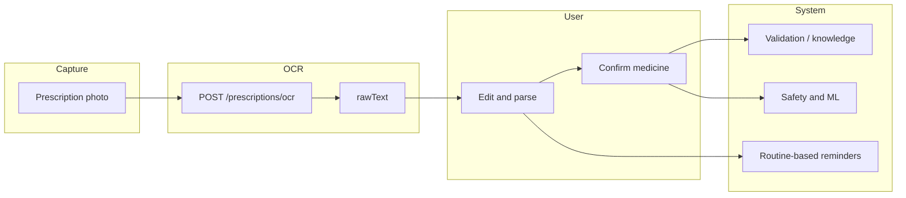

# Prescription OCR and how extracted data is used

This document describes how prescription images are turned into structured fields and how those fields connect to **validation**, **reminders**, and **safety checks** in ElderMeds.

## 1. Medicine Input Methods

The user can start a medicine check in exactly one of these ways:

1. **Type medicine name** (manual text input with medicine suggestions)
2. **Scan prescription image** (photo upload + OCR)
3. **Speak medicine name** (voice-entry flow; speech-to-text via keyboard mic or typing fallback)

All three methods produce the same normalized medicine payload before safety analysis.

## 2. Upload and OCR

1. The user chooses **Scan prescription** and picks a photo (library). The app sends the image to `POST /api/prescriptions/ocr` with JWT authentication.
2. The server runs **OCR preprocessing** before text extraction:
   - orientation normalization
   - grayscale conversion
   - contrast enhancement
   - noise reduction
   - binarization (black/white thresholding)
3. After preprocessing, the server runs **Tesseract.js** (English) and returns `rawText`, confidence, and preprocessing metadata. The first OCR request on a new machine may take longer while English language data is downloaded and cached.
4. The user sees the extracted text on **Prescription text**, can edit it, then taps **Parse & continue**. Parsing uses `extractMedicineFromText` in the app to split **medicine name**, **dose**, and **frequency** where possible.

OCR is intentionally **assistive**: handwriting and poor photos can be wrong, so the user always confirms or corrects text before it affects safety logic.

## 3. Validation

After parsing, the user confirms the medicine on the **confirm** step. From there, the same path as manual entry applies:

- The medicine name is matched against the local **medication knowledge** service (`/api/medications/search`, `/api/medications/knowledge`) for spelling, class, and interaction hints.
- Profile fields (allergies, conditions, other medicines, questionnaire answers) are sent with the check so the backend can flag **interactions** and **contraindications**.

So **validation** means: structured OCR output plus user confirmation, then server-side enrichment and rule-based checks—not blind trust in OCR.

## 4. Reminders

ElderMeds ties reminders to the user’s **routine** (meal and sleep times from `/api/routines`). OCR-derived **frequency** (for example “twice daily”) is stored with the medicine check context; aligning exact alarm times with parsed free text is still guided by the user’s saved routine and any future per-medication schedule fields.

In short: **reminders** use the routine as the clock; OCR supplies **how often** the medicine is intended, which the user can fix before saving.

## 5. Safety checks

Safety combines:

- **Knowledge-backed analysis** (side effects, interactions, severity labels) from the medication knowledge layer.
- **ML risk** (`mlPredictionService`) when a trained model is present, using the same structured payload built from medicine name, profile text, and questionnaire answers—including `inputMethod: 'scan'` and optional `rawOcrText` in the clinical narrative for auditability.

Safety checks therefore run **after** OCR and parsing, on **user-reviewed** data, together with the full profile.

## 6. Data flow summary

End-to-end: **image → OCR text → user edit → parse → confirm → validation & safety**; **reminders** stay anchored on routine times with frequency informed by the parsed prescription.
